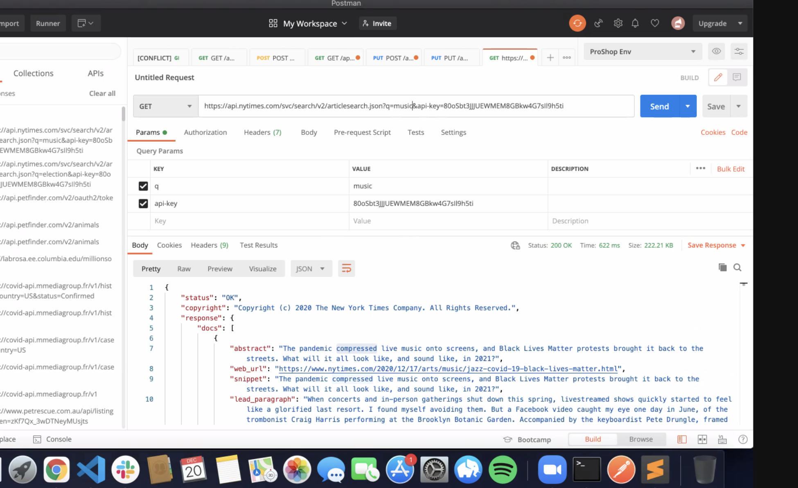
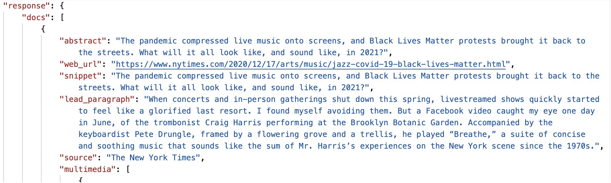
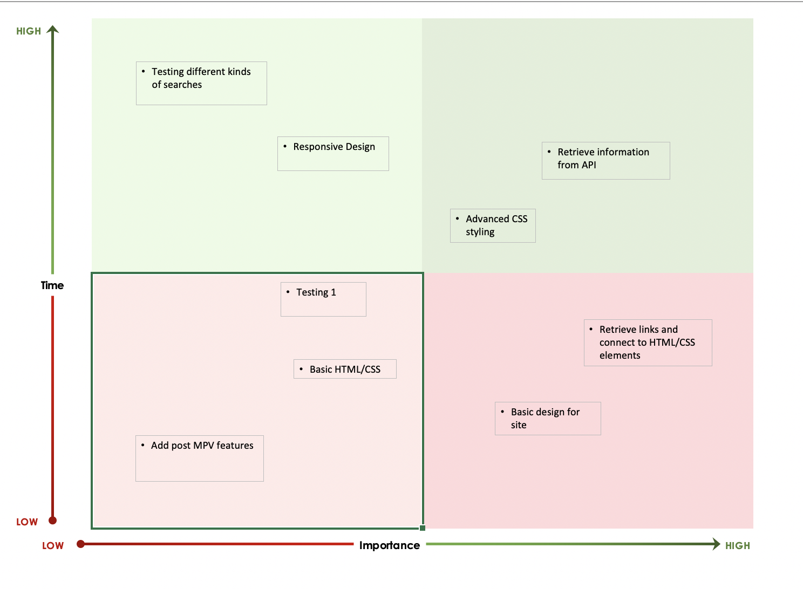

# classicalmusic
## A classical music search app to find reviews on NYT

### Katharine Chandler

The purpose of the app is to search for music reviews in the New York Times

This is an app that will search for classical music reviews in the New York Times. You may ask yourself: can’t you just do that on the Web site? But oh no, not really! Have you ever searched for any article at all in the NYT? Good luck with that! My theory is that they have controlled vocabulary problems but that is a bigger fish to fry. In the meantime, this will be a rather simple little interface that will be immensely helpful (I hope!) to quite a few people I know.

### API:

The API I am using is from the NYT: I have saved controlled vocabularies and articles and semantic and books searches in order to retrieve the key (required by the NYT dev site).

### API Snippet:

Here is JSON retrieved from Postman: 

                           

### Wireframes

Here is a wireframe for this project.

### MVP

These are the features needed to meet the Minimum Viable Product:
1. Interactive search feature: using an axios call to retrieve that information
2. Lists of results and links to the NYT page
3. (NB: the difficulty of putting together this app will be dealing with the NYT controlled vocabularies, which seem to be problematic)

### Post MVP

Additional feature could include deeper search parameters, other kinds of classical-music-related searches (such as books), videos and picture results

### Goals

Day 1 (Dec 21): Project pitch due. Evening: Pseudocoding to work out initial code to get event listeners working and retrieve the data from the site.

Day 2 (Dec 22): Pseudocoding: Structure the html, css, and finish any more JS for the site. 

Day 3 (Dec 23): Continue working out css, html, and JS bugs. 

Day 4 (Dec 26): Testing

Day 5 (Dec 27): Hopefully the site will work by this time!

Day 6 (Dec 28): Possible post-MVP options: bring in videos or pictures or recordings

### Track Progress

### Timeframes

| Day \# | Date   | Task                                                                         | Hours projected | Hours completed | Hours total |   |   |   |
|--------|--------|------------------------------------------------------------------------------|-----------------|-----------------|-------------|---|---|---|
| Day 1  | Dec 21 | finishing readme and initial trials                                          | 3               |    7             |     7        |   |   |   |
| Day 2  | Dec 22 | Pseudocoding: Structure the html, css, and finish any more JS for the site\. | 6               |     7            |     7        |   |   |   |
| Day 3  | Dec 23 | Continue working out css, html, and JS bugs\.                                | 6               |     5            |      5       |   |   |   |
| Day 4  | Dec 26 | Testing                                                                      | 6               |     3            |      3       |   |   |   |
| Day 5  | Dec 27 | Hopefully the site will work by this time\!                                  | 6               |     3            |       3      |   |   |   |
| Day 6  | Dec 28 | Possible post\-MVP options: bring in videos or pictures or recordings        | 6               |     4            |        4     |   |   |   |

